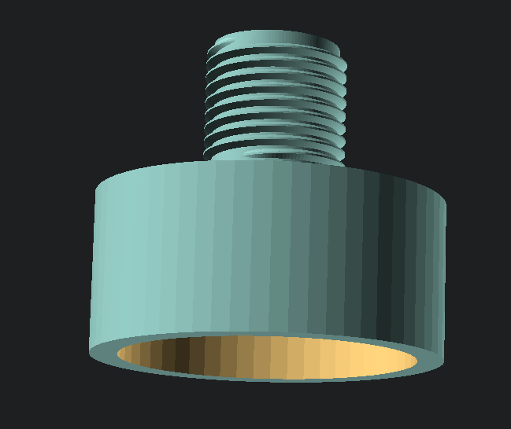

# SGS Air Compressor

This relies on the following OpenSCAD Libraries:

 * [openscad/scad-utils](https://github.com/openscad/scad-utils)
 * [list-comprehension](https://github.com/openscad/list-comprehension-demos)
 * [threadprofile.scad](https://github.com/MisterHW/IoP-satellite/blob/master/OpenSCAD%20bottle%20threads/thread_profile.scad)

Move into the `OpenSCAD/libraries` and clone down the appropriate repositories.

```bash
pushd ~/.local/share/OpenSCAD/libraries
git clone https://github.com/openscad/list-comprehension-demos.git
git clone https://github.com/openscad/scad-utils.git
wget https://raw.githubusercontent.com/MisterHW/IoP-satellite/refs/heads/master/OpenSCAD%20bottle%20threads/thread_profile.scad
popd
```

Reload OpenSCAD.

## Description

The standard air filter is alleged to be restrictive. By replacing the filter with a motorbike pod filter, it is alleged that the recharge time can be greatly improved by up 15 seconds.

By examining the existing filter housing, it seems like this figure could be improved upon if the insides were cut clear.



This design removes the inner components in an attempt to create a less restrictive flow.


