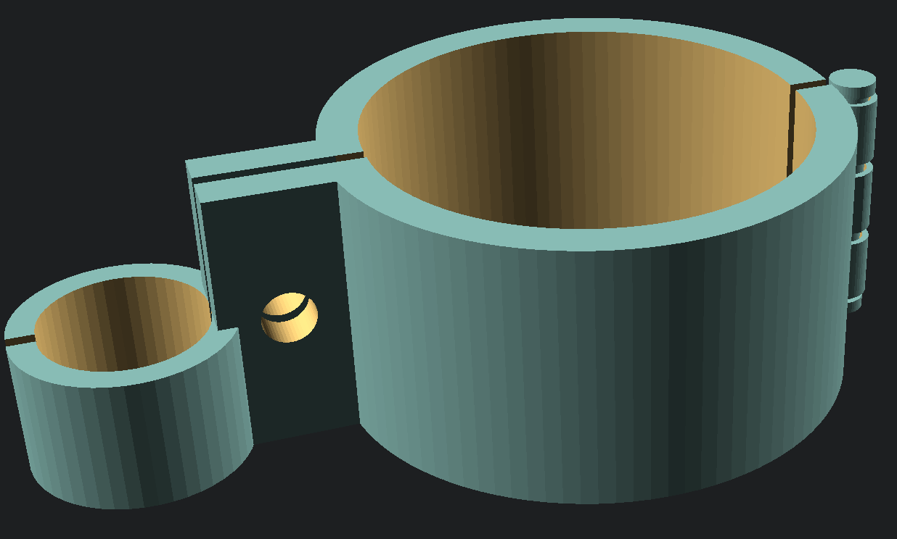
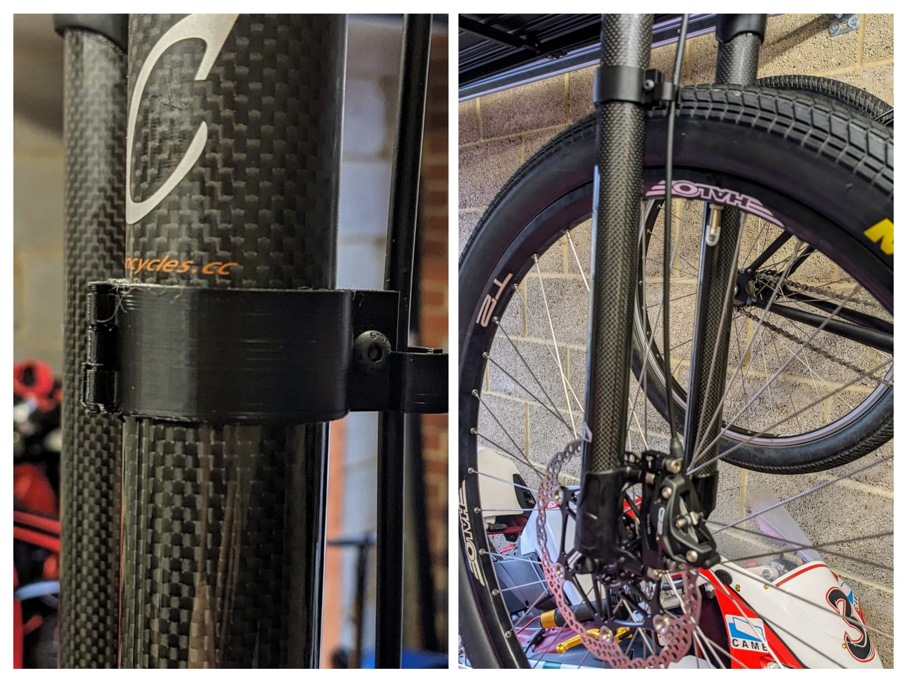

# eXotic Carbon Rigid Fork Brake Guide

This is a clamp that's designed to fit around the fork tube of an `eXotic Carbon Rigid` mountain bike fork that enables the brake line to fastened to the fork leg to stop it rubbing on the wheel.

The clamp is designed to pivot around the pin located to the rear of the item. A small M4 bolt and nut can be used to tighten the clamp over the fork tube to stop it from moving.

