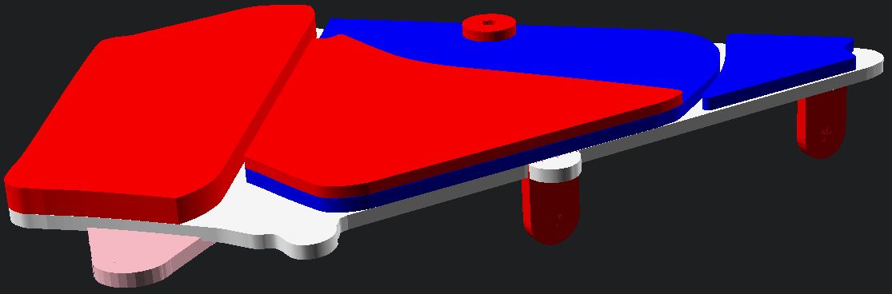

# Airbox Delete

A blanking panel for the side fairing to mount to.

Deletes the air box and provides the appropirate mounting location for the fairing to fasten to. Two mounts to the rear allow the provisioning of the mudguard.
