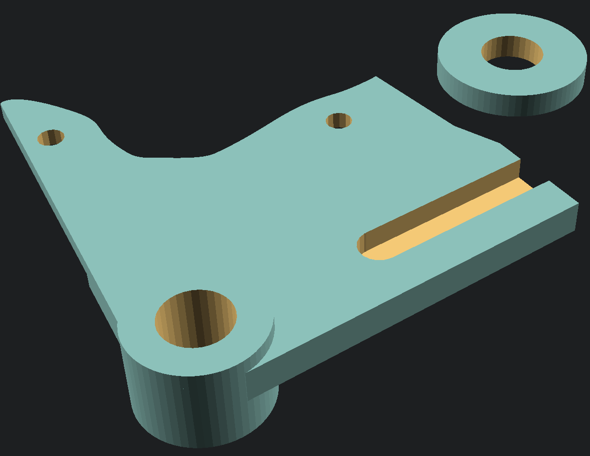

DTR Rear Carrier
===

The Leviathan sports a set of 2006-2011 Aprilia RS 125 wheels with a 1999-2005 front brake and a 2006-2011 rear brake. To complement this, a Yamaha DT200R 3ET rear aluminium swinging arm has been source.

This model is to fit the rear brake/wheel into the swinging arm.

SVG OpenSCAD to FreeCAD
===

For convenience, the [outline-curved.scad](./outline-curved.scad) has been uploaded, but this was generated using the [SVG to OpenSCAD Bezier - Inkscape extension](https://www.thingiverse.com/thing:2805184).

The reason for this is that FreeCAD (which is needed to create the CNC STP file) doesn't support OpenSCAD `import` and as such fails to load the model. So the SVG needs to be converted to a series of vanilla polygon curves in OpenSCAD first, then it can be imported into FreeCAD.
