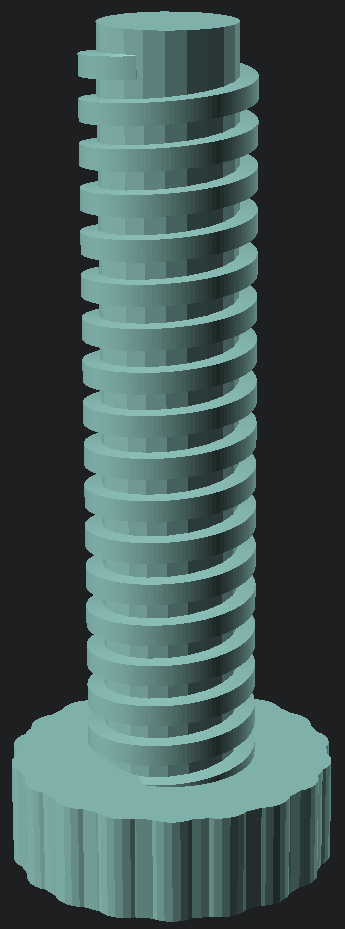
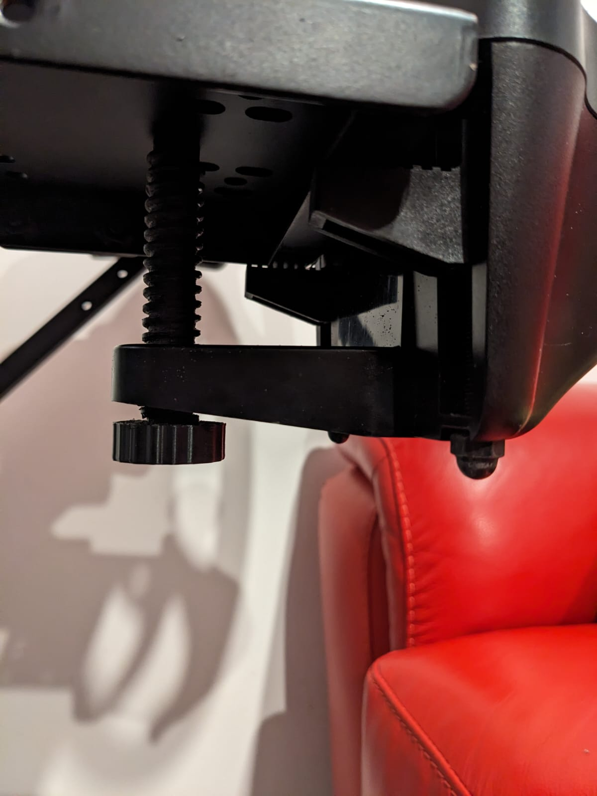

# Logitech G25/27/29/920 Gear Assembly Rear Screw Mount

This is the rear screw that mounts to the gear shifter assembly for the Logitech G25/27/29/920.

Ideal for tables that are shallow and the default screw doesn't touch.

Once printed, chase the threads with an M16x4.0mm die, or a fine file.
