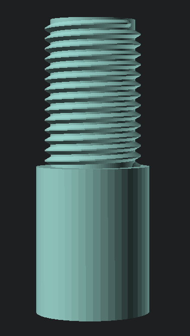

# Logitech G25/27/29/920 Gear Knob Adaptor

This relies on the following OpenSCAD Libraries:

 * [openscad/scad-utils](https://github.com/openscad/scad-utils)
 * [list-comprehension](https://github.com/openscad/list-comprehension-demos)
 * [threadprofile.scad](https://github.com/MisterHW/IoP-satellite/blob/master/OpenSCAD%20bottle%20threads/thread_profile.scad)

Move into the `OpenSCAD/libraries` and clone down the appropriate repositories.

```bash
pushd ~/.local/share/OpenSCAD/libraries
git clone https://github.com/openscad/list-comprehension-demos.git
git clone https://github.com/openscad/scad-utils.git
wget https://raw.githubusercontent.com/MisterHW/IoP-satellite/refs/heads/master/OpenSCAD%20bottle%20threads/thread_profile.scad
popd
```

Reload OpenSCAD.

This is a gear knob adaptor which allows for an M12x1.25 pitched gear knob to be fitted in place of the original.



The component slides over the gear knob shaft and is keyed against shaft to stop it rotating when in used.


The screw is recessed down into gear knob to lock the item in place.


Once this has been fitted, screw in your M12x1.25 gear knob on the top and a voila!


## Post Print

You will need to chase the threads with an appropriate die (M12x1.25) before fitting the gear knob.
