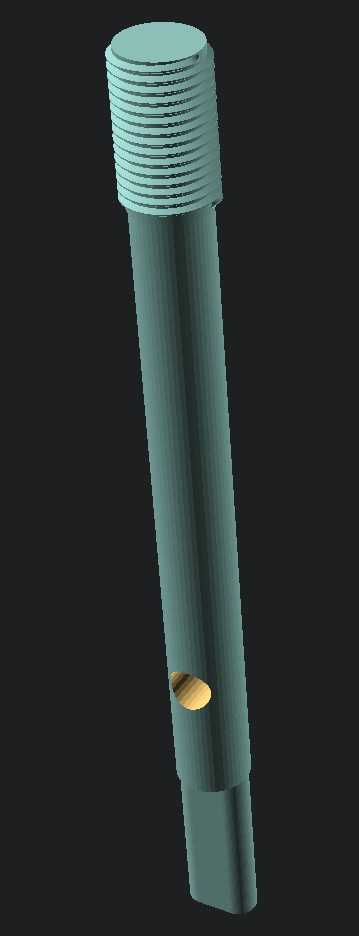

# Logitech G25/27/29/920 Gear Knob Adaptor Shaft

This relies on the following OpenSCAD Libraries:

 * [openscad/scad-utils](https://github.com/openscad/scad-utils)
 * [list-comprehension](https://github.com/openscad/list-comprehension-demos)
 * [threadprofile.scad](https://github.com/MisterHW/IoP-satellite/blob/master/OpenSCAD%20bottle%20threads/thread_profile.scad)

Move into the `OpenSCAD/libraries` and clone down the appropriate repositories.

```bash
pushd ~/.local/share/OpenSCAD/libraries
git clone https://github.com/openscad/list-comprehension-demos.git
git clone https://github.com/openscad/scad-utils.git
wget https://raw.githubusercontent.com/MisterHW/IoP-satellite/refs/heads/master/OpenSCAD%20bottle%20threads/thread_profile.scad
popd
```

Reload OpenSCAD.

This is a gear knob adaptor shaft which replaces the original shaft and allows for an M12x1.25 pitched gear knob to be fitted in place of the original.



## Post Print

You will need to chase the threads with an appropriate die (M12x1.25) before fitting the gear knob.

Two M4x0.7mm Rivnuts are required to go into the sides of the shaft to allow the stays to be screwed in place.
